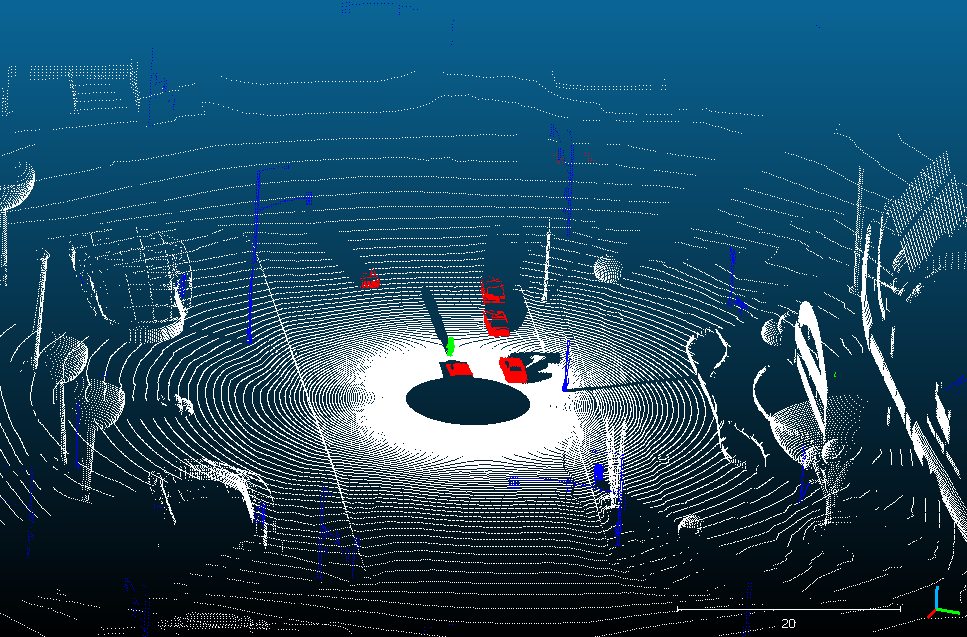

# LiDAR-GTA-V

============================
*A plugin for Grand Theft Auto V that generates a labeled LiDAR point cloud from the game environment.*

## Installation

0. Current version of GTA-V is `1.0.3095.0`
1. Install [ScriptHookV](http://www.dev-c.com/gtav/scripthookv/) following its accompanying instructions
2. Install [Autonomous-Driving](https://www.gta5-mods.com/scripts/seamless-autonomous-driving-mod-no-keys-menus-or-buttons) and its dependencies to make vehicles moving automatically
3. There are a few Mods that can adjust the game environment, like editing [gameconfig.xml](https://gameskeys.net/how-to-install-gameconfig-1-0-2060-mod-in-gta-5/)

4. Copy-paste `LiDAR GTA V.asi` and the `LiDAR GTA V` folder from the latest [***release***](https://github.com/UsmanJafri/LiDAR-GTA-V/releases) into your GTA-V directory (the folder containing `GTAV.exe`)

5. (suggested) install [launcher bypass](https://gta5mod.net/gta-5-mods/tools/gtavlauncherbypass-1-3/) to save time

## How to use

1. Navigate to `#your_game_directory#/LiDAR GTA V/LIDAR GTA V.cfg` and edit the parameters as needed. And modify the absolute path to this `.cfg` file in the `lidar.cpp`
2. create a `data_set` folder in GTA-V directory (the folder containing `GTAV.exe`) as well as a `Games` folder in `D:/`
3. Start up GTA-V in story mode
4. Press `F6` to generate read all those config files when you think it is suitable.
5. Follow the instructions in the notification box.
6. If want to try out *autonomous-driving*, follow the corresponding instructions
7. Output file is located under `#game_directory#/data_set/{index}.txt`
8. The output is a `.txt` file which contains `x, y, z, r, g, b, n_x, n_y, n_z`
9. Vertex Color Code:

    | Vertex Color | Label |
    |---|---|
    |  Red  | Vehicle |
    |  Green | Humans and Animals |
    |  Blue | Game props |
    |  White | Road, Buildings and other hitable textures |
    |  Black | No hit |

10. I strongly recommend that you take a look at the written code in `lidar.cpp`, which may help you understand better(for I am not a developer in Games)

11. Some of the processing python scripts are stored in `src`

## Developer Notes

(Mostly copied from the original readme)

* You will need Visual Studio 2022 or higher to open this project
* The project requires the ***Desktop development with C++*** workload to be installed in Visual Studio
* The project is targetted at Visual Studio Platform Toolset **v143**
* To make development easier, the project will automatically copy the compiled **LiDAR GTA V** plugin to the directory `D:\Games\GTAV\` after building

    You may want to set this path to point to your GTA-V installation directory. This can be done by right-clicking *LiDAR GTA V* in the *Solution Explorer* and editing the `Command Line` field under `Configuration Properties -> Build Events -> Post-Build Event -> Command Line`
